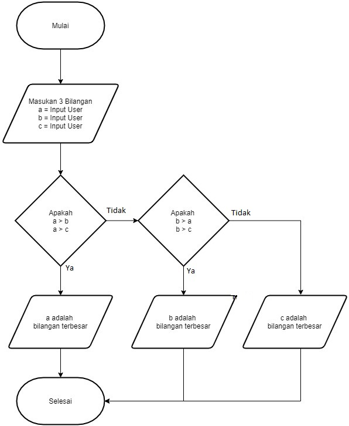

# labspy02

Berikut adalah Flowchart dari code python yang akan saya buat.

Ini adalah code pyhton saya

Dan ini adalah hasil output dari Program di atas:
Kondisi 1, angka 1 adalah angka terbesar.
Dengan input 3,2,1

Kondisi 2, angka 2 adalah angka terbesar.
Dengan input 1,3,2

Kondisi 3, angka 3 adalah angka terbesar.
Dengan input 3,2,1

